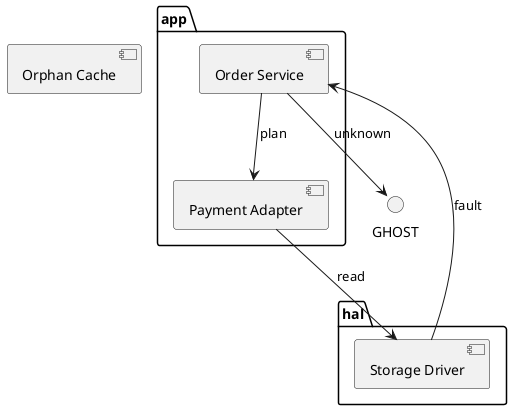

# Structure Review Guide

How to audit a component, package, class or deployment diagram as a dependency graph: the matrix schema, every finding code, a worked example, and the method for reconciling the diagram with a source-side check.

The tool is `logicprobe_structure_verify`. A host without it runs the repository engine on the same diagram text; the parity test compares the two field for field.

## Inputs

```text
logicprobe_structure_verify  { diagram: "<PlantUML or Mermaid class text>", notation?: auto|plantuml|mermaid, matrix?: {...} }
```

**Accepted diagram families**: PlantUML `component`, `package`, `class`, `interface`, `enum`, `object`, `actor`, `usecase`, `database`, `node`, `artifact`, `deployment`, `rectangle`, `folder`, `frame`, `cloud`, `queue`, `stack`, `storage`, `collections`, `agent`, `boundary`, `control`, `entity`, `namespace`, `module`; Mermaid `classDiagram` (`class X`, `X --> Y : label`, `X ..|> Y`).

**Edge forms** (PlantUML): `-->`, `->`, `..>`, `--`, `==>`, `<--`, `<..`. Mermaid class: `-->`, `..>`, `--|>`, `..|>`, `--`, `..`.

**What is read**: declarations (with `as` aliases and quoted labels), container nesting (`package "app" { … }`), arrows with labels, and note blocks (skipped — a note is not a dependency). Anything else is reported as `STRUCTURE_IGNORED_LINE` in `warnings`, never silently dropped.

**Node identity**: the alias/id when one exists (`component [Order Service] as SVC` → `SVC`), otherwise the declared name. An endpoint that only ever appears in an arrow still becomes a node, marked `declared: false` — that is what `UML021` reports.

## Matrix schema

```jsonc
{
  "rules": [
    {
      "id": "R1",              // required, unique; this is what the report cites
      "source": "app.*",       // node id or glob; absent = the rule judges no source
      "allow": ["hal.*"],      // permitted targets (glob or id)
      "deny": ["hal.secret"],  // forbidden targets; deny wins over allow, globally
      "require": false         // true = an edge matching source→allow must exist (UML025)
    }
  ],
  "layers": [
    { "name": "app", "members": ["SVC", "PAY"] },   // top first
    { "name": "hal", "members": ["DRV", "DB"] }
  ],
  "default": "allow"           // or "deny": anything unlisted is a violation
}
```

Rules:

- Glob: `*` matches any run of characters (including `.` and `:`), `?` exactly one. `app.*` matches `app.motion`, not `hal.app`.
- **Deny is global.** Evaluation collects every rule whose `source` matches the edge, then: any deny match ⇒ violation; else any allow match ⇒ permitted; else the matrix `default` decides (`default` basis vs `unlisted` basis). The verdict cannot depend on rule order.
- `default: "allow"` is the permissive default: rules are exceptions. `default: "deny"` is the closed-world form and is what most architecture tables actually mean.
- Layers are independent of rules and are evaluated on every edge whose endpoints both belong to a layer: index order is top→bottom, so `app → hal` is allowed and `hal → app` is `UML024`.
- An invalid matrix is a hard error (`MATRIX_INVALID`) and no rules apply — a typo must never silently weaken the check. Unknown keys, duplicate rule ids, non-string patterns and `require` without `allow` are all rejected.

## Finding codes

| Code | Severity | Evidence | How to read it |
|---|---|---|---|
| `UML020_ISOLATED_NODE` | warning | `nodes[{id,line}]` | Declared, non-container, degree 0. Either a dead entry or a forgotten dependency. |
| `UML021_DANGLING_REFERENCE` | error | `nodes[{id,line}]` | An arrow endpoint no declaration introduced. The dependency targets something the diagram never defines. |
| `UML022_CYCLE` | error | `cycle[]`, `path[]` | Shortest directed cycle, start repeated (`A → B → C → A`). A self-loop is a cycle of two elements (`A → A`). |
| `UML023_DISALLOWED_EDGE` | error | `edge{from,to,line}`, `rule?`, `matchedRules[]`, `basis` | `basis: deny` means a rule forbade it; `basis: unlisted` means no rule allowed it under `default: deny`. |
| `UML024_LAYER_VIOLATION` | error | `violations[{from,to,fromLayer,toLayer,line}]` | An upward edge between declared layers. |
| `UML025_MISSING_EXPECTED_EDGE` | warning | `missing[{rule,source,expected,unsatisfiedFrom,noSourceMatch}]` | A `require: true` rule the diagram does not satisfy. `noSourceMatch` distinguishes "wrong target" from "no such source node". |
| `UML026_NO_NODES` | error | `notation` | Nothing to review; the text is not a structure diagram. |
| `MATRIX_INVALID` | error | — | The matrix was rejected; its messages name the exact field. |

Every report also carries `summary` (nodes, edges, containers, isolated, dangling, cycles, disallowedEdges, layerViolations, missingExpectedEdges, errors, warnings, rules), `edgeVerdicts` when a matrix was supplied, and `verdict` / `verdictReason`. A structure diagram with an error finding is `verdict: "fail"` even though `ok: true` — `ok` only means the tool ran.

## Worked example

The diagram (a real shape: two packages, an orphan, a back edge, an undeclared endpoint):



Without a matrix the structural checks already speak:

```text
UML021_DANGLING_REFERENCE (error)   GHOST is never declared
UML020_ISOLATED_NODE      (warning) CACHE has no edge
UML022_CYCLE              (error)   SVC → PAY → DRV → SVC
verdict: fail
```

With the matrix from the skill body (`default: "deny"`, layers `app` over `hal`):

```text
UML023_DISALLOWED_EDGE (error)  DRV → SVC  basis=deny      (R3-no-back-edges)
UML023_DISALLOWED_EDGE (error)  SVC → GHOST basis=unlisted (no rule allows it)
UML024_LAYER_VIOLATION (error)  DRV (hal) → SVC (app)
verdict: fail, disallowedEdges: 2, layerViolations: 1
```

Both `UML022` and `UML023` fire on the same back edge: the cycle is a graph property, the violation is a matrix property. Report both — they are different findings with different fixes (a cycle needs restructuring; a disallowed edge needs either the edge removed or the matrix amended deliberately).

## Reconciliation with a source-side check

The diagram and an include/dependency scan over the source are two representations of one fact, and they drift. Keep the rule ids identical on both sides, then classify each difference:

| Difference | Reading | Action |
|---|---|---|
| Code has the include, diagram has no edge | The diagram is stale | Redraw; `require: true` makes this a `UML025` warning every run |
| Diagram has the edge, code has no include | Either the diagram is aspirational, or the scan scope is narrower (generated files, `#ifdef`, build-time includes) | State which, with both citations |
| Code violates a rule the diagram never showed | The architecture defect the diagram hid | Fix the code, or amend the rule deliberately and record why |
| Both agree an edge is forbidden | A real violation, agreed by two methods | Act on it |

Never present the diagram's clean verdict as evidence about the code: it is evidence about the drawing. The reconciliation is the part that touches the source.

## Multi-granularity: one architecture at several levels

A module-level diagram and the repository-level diagram it belongs to are two views of one
fact, and nothing keeps them in step. Declare the relation and both are checked:

```text
logicprobe_structure_verify  { diagrams: [ { name, diagram, parent? }, … ] }
logicprobe_structure_verify { diagrams: [ { name: "L1", diagram: "…", parent: "L0" }, … ] }
```

Per-diagram structural checks run first (UML020-UML026), and every finding is tagged with
the `file` it came from, so a report over several levels never carries an anonymous
finding. Then each declared pair is checked:

| Code | Severity | What it means |
|---|---|---|
| `UML028_UNKNOWN_PARENT` | error | The `parent` names a diagram that is not in the set. |
| `UML029_REFINEMENT_VIOLATION` | error | **invented-edge**: the child draws a dependency between two nodes the parent also has, but the parent does not. **unexpanded-edge**: the parent draws an edge between two nodes the child also has, the child does not draw it, and no child path connects the same ends. |
| `UML030_PARENT_CYCLE` | error | The parent relation contains a cycle, so "which level owns this dependency" has no answer. |
| `UML031_NO_DIAGRAMS` | error | Nothing was supplied to compare. |

The rule is *refinement*, not equality: a child may add nodes and edges **below** the
parent level (an edge with an endpoint the parent does not have is the child's own
detail), and it may cover a **subtree** of the parent — a parent edge whose ends are not
both present in the child is out of scope for that level, not dropped. What it may never
do is invent a dependency at the parent level, or silently drop one it should have
expanded.

Each pair is summarised so the counts can be read without diffing two diagrams by eye:

```json
{ "parent": "L0", "child": "L1",
  "parentNodes": 3, "childNodes": 4, "parentEdges": 2, "childEdges": 4,
  "inheritedEdges": 1, "newEdges": 2,
  "expandedEdges": [{ "from": "SVC", "to": "PAY", "line": 5 }],
  "missingEdges": [], "inventedEdges": [] }
```

A parent edge the child replaces with a path is a **legitimate expansion**, and it is
listed in `expandedEdges` rather than silently accepted: a reviewer confirms each one,
because that is where a refactoring quietly changes who calls whom. `hashes.diagrams`
records a sha256 per level, so a baseline diff can tell which level moved.

The same discipline as the single-diagram review applies: this checks the *diagrams*
against each other, not against the code. A level that is consistent with its parent but
not with the code is a drawing bug; a level that disagrees with its parent is a hierarchy
bug. Both need the source-side scan to settle.

## Extracting the matrix from an existing rule table

A machine-checked rule table (an include/dependency checker, a lint config, a review checklist) can seed the matrix: one rule entry per row, `id` = the row's own number so citations line up, `source`/`allow`/`deny` = the row's patterns, `layers` = the layering the table describes. Review the result before trusting it — a translation that silently widens `deny` into `allow` is worse than no check. Keep both files under version control together, and treat a matrix change as a code change.

## Limits

- The graph is what the diagram draws. Function pointers, DI, registries, plugins and dynamic dispatch are invisible.
- No transitive closure unless you write the rule for it.
- Containers (`package`, `rectangle`, `frame`) are exempt from the isolated-node check by design.
- `STRUCTURE_IGNORED_LINE` warnings mean the parser met a statement it does not model; treat a non-empty list as a signal that the diagram family may not be the one you think it is.
- Behaviour is out of scope: state machines, protocols, timing, budget, probability and deadlines belong to `logicprobe` (verification) and `logicprobe-uml` (the diagram round trip).
