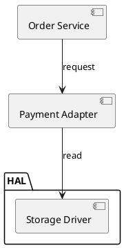

# UML Modelling Guide

This guide covers two jobs: drawing a code flow as UML, and reviewing that drawing. Load it when the task is "show me the flow" rather than "check this claim". Typical cases are reverse-engineering a handler, documenting a protocol, or auditing a diagram somebody else drew.

One rule runs through the whole guide. **A diagram is a model, and a model can be wrong.** A tidy flow chart is not evidence about the code. Worse, a diagram that disagrees with the model it came from will mislead every reader who trusts it.

## When to use this

| Situation | View that answers it |
|---|---|
| "What are the states of this handler, and what moves between them?" | State machine |
| "What does this function actually do, including its error paths?" | Activity (flow) |
| "In what order do these messages arrive, and what is the state after each?" | Sequence |
| "Somebody gave me a diagram. Is it right?" | Any view. Feed it to the review and compare it against the code. |
| "This diagram and this model disagree." | Feed both to the review. The round-trip check names every difference. |

Do not use this guide for a behavioural claim about a specific machine. That is the job of `logicprobe_verify` (S1-S8 and A1-A14). The review here covers the modelling, not the behaviour. Every finding it produces names the engine check that settles the behavioural half.

## The three views

One machine, three projections. They are not interchangeable. The review reports which view it saw, and the differences matter.

**State machine** (`stateDiagram-v2`, or a PlantUML state diagram). This view shows the whole topology: every state, every event-and-guard branch, and every terminal state as `--> [*]`. Model code flow into this view, and use it for review. It is the only view that round-trips without loss.

**Activity** (`flowchart TD` in Mermaid). This view draws the same machine as work rather than as states. Each edge carries `event [guard] / actions`. It suits a reader who thinks in steps. It holds the same information as the state view. PlantUML activity is **not** generated: its structured-flowchart syntax needs a while/if reconstruction for any graph with a merge or a cycle. A diagram that quietly reshapes the machine is exactly the failure this feature exists to prevent, so the tool refuses that combination.

**Sequence** (`sequenceDiagram`). This view shows one BFS trace: the messages in the order a walker meets them, with a note per state change. A trace is not a machine. Branches appear as separate guarded messages, paths the walk never took are absent, and the trace is capped. Use it to show a protocol exchange to a human. It cannot be the review's fidelity input, because `parse` refuses it and `review` reports the check as inapplicable (`UML019`).

## Modelling a code flow from source

Extraction follows the same discipline as `logic-verification-guide.md`, applied to code instead of a plan. That guide ships with the entry-point skill: `../logicprobe/references/logic-verification-guide.md`.

1. **Fix the boundary.** Decide which function, task, or module is the machine. In scope: state the code holds across calls, such as statics, fields, enums, and task state variables. Out of scope: the call stack inside one invocation, hardware behaviour, and scheduler preemption.
2. **Name the states from the code.** A state exists if something survives a call boundary and is tested later. An enum, a `state` field, or a task-local variable that gates the next entry all qualify. A local variable inside one function does not.
3. **Name the events from the code.** Every edge must trace to a call site, a message, a timer expiry, or an ISR. An edge with no call site is a guess. Put it in the review findings instead of the model.
4. **Record guards and actions verbatim.** A guard must be the real condition, with the real variable and the real constant. A retry limit of 3 modelled as "a few" is a model of your assumption, not of the code.
5. **Mark the terminals.** An absorbing state is `terminal: true`. Examples are power-off, fatal, and done. If nothing is terminal, say so. The review will flag it either way.
6. **Write the narrative as you go.** The `narrative` block holds natural-language meanings for states and events, plus a scenario for each state-and-event pair. It is what lets a reader check the diagram against the code without re-deriving every symbol. Once the block is present, the schema requires all three parts and full coverage, so it cannot rot half-way.

### Evidence rule

Every state, event, guard and action needs a citation. Use `file:line` for code and a section reference for a document. A UML model without citations is a drawing. It cannot be reviewed, only admired. Present the citations together with the model.

### Confirming the model

The usual gate applies: show the extracted transition table or the diagram, and get confirmation before treating the model as fact. In `logicprobe interaction=auto`, skip the question. Instead, cite evidence for every element, round-trip the model (render, parse, compare), and mark the result `UNCONFIRMED`.

## Rendering

In DSH:

```json
{ "action": "render", "model": { "...LogicModelV1..." }, "notation": "mermaid", "kind": "state" }
```

`logicprobe_uml` with `action=render` returns the diagram source plus `warnings`. Read those warnings. They list every construct the notation could not carry verbatim: a state id that needed an alias, a label containing `[` or `/`, a trace that was capped.

Without the DSH tool, run the repository engine on the same model JSON.

You can also write the diagram by hand. The generator is a convenience, not a requirement. A hand-written diagram is parsed and reviewed exactly like a generated one.

### Directives in generated diagrams

Generated text carries comment lines. Mermaid and PlantUML ignore them. The parser reads them:

```text
%%logicprobe:uml v1 notation=mermaid diagram=state
%%logicprobe:init INIT
%%logicprobe:terminal FATAL
%%logicprobe:alias S_1 1st state
%%logicprobe:variable retry integer
```

These lines exist because the notation cannot express everything the model knows. `[*]` marks an initial state, but a flowchart has no such marker. A state id may contain characters the notation cannot spell. A boolean assignment (`armed := 1`) looks exactly like an integer one. Pinning those facts in comments is what makes the round-trip check exact instead of approximate. PlantUML uses `'` instead of `%%`.

A hand-written diagram needs none of these directives. Adding `%%logicprobe:init` and `%%logicprobe:terminal` to a flowchart is how you say which node starts and which one ends.

## Reviewing the modelling

```json
{ "action": "review", "model": { "...LogicModelV1..." } }
```

Four input shapes, four different questions:

| Input | Question answered |
|---|---|
| `model` only | Is this machine well-modelled? The review checks its structure, then renders and re-parses it to prove the diagram carries it. |
| `diagram` only | What does this diagram actually say? The diagram is parsed into a model, and that model is reviewed. Fidelity to code is **unchecked** (`UML018`). |
| `model` + `diagram` | Does the diagram match the model? Every structural difference is a modelling defect (`UML017`). |
| `model` + `kind: "sequence"` | The trace is rendered and the structure is reviewed, but the fidelity check **does not apply** (`UML019`). A trace cannot be parsed back into a machine, so the review says so instead of pretending it verified the diagram. `maxSteps` caps the trace. |

### Findings

| Code | Severity | What it means |
|---|---|---|
| `UML001_DIAGRAM_UNREADABLE` | error | The text is not readable as a Mermaid or PlantUML state or activity diagram. |
| `UML_NOT_A_STATE_DIAGRAM` | error | The text belongs to another diagram family. Numbers are reserved for `UML0xx` modelling findings, so this one carries a name instead; see [Structure diagrams are not models](#structure-diagrams-are-not-models). |
| `UML002_UNREACHABLE_STATE` | error | No transition can enter this state from init. The diagram draws flow nobody can reach. The check is structural and ignores guards; S1 is the guard-aware check. |
| `UML003_DEAD_END_STATE` | error | A non-terminal state has no outgoing transition. Either it is terminal, or the outgoing flow was never modelled. |
| `UML004_AMBIGUOUS_BRANCH` | error | Two unconditional arrows share one state and event. No reader and no implementation can resolve that. S4 is the authoritative check. |
| `UML005_OVERLAPPING_GUARD` | warning | The same guard text appears twice in one branch group. |
| `UML006_INEXHAUSTIVE_BRANCH` | warning or info | The branch group has only guarded branches and no default. The severity is `warning` when the guards do not look complementary. It is `info` when a complementary pair such as `k < 3` and `k >= 3` is present, which is probably exhaustive. Only S6 can settle it. |
| `UML007_UNUSED_EVENT` | warning | The event fires only from unreachable states. The diagram shows messages that never arrive. |
| `UML008_SELF_LOOP_NO_EXIT` | warning | An unguarded self-loop has no other exit. The diagram presents it as progress, but the flow never leaves. S3 reports absorbing cycles. |
| `UML009_DUPLICATE_TRANSITION` | warning | The same from, event, guard, actions and target row appears twice. |
| `UML010_UNUSED_VARIABLE` | warning | No guard reads this variable and no action writes it. It is a symbol with no source. |
| `UML011_UNBOUNDED_VARIABLE` | info | An integer variable has no min or max, so no range invariant can be checked and A5 has no declared domain. |
| `UML012_NO_TERMINAL` | warning | No state is terminal, so completion, failure and a stuck flow all look the same. |
| `UML013_NO_NARRATIVE` | info | The model carries no meanings, so a reader must re-derive every symbol from the source. Adding a partial narrative is a valid first step. |
| `UML027_NARRATIVE_PARTIAL` | info | The narrative covers part of the model. `narrativeCoverage` (also in the finding's `evidence`) reports `covered/total` per dimension — states, events, scenarios. Incomplete is not wrong. |
| `UML014_UNDOCUMENTED_STATE` | info | These states render as their bare id, so the diagram cannot be read against the code. |
| `UML015_LABEL_DRIFT` | warning | A diagram label disagrees with the model narrative. One of the two is stale, and the review cannot tell which. |
| `UML016_DIAGRAM_PARSE_NOTES` | info | Notes collected while rendering or reading the diagram. They mark information the notation could not carry. |
| `UML017_ROUND_TRIP_MISMATCH` | error | The diagram does not carry the model. Transitions were lost or invented, or init, terminals or variables differ. The `roundTrip.diffs` array lists each one. |
| `UML018_FIDELITY_UNCHECKED` | info | Only a diagram was supplied, so nothing here proves it matches the code. |
| `UML019_ROUND_TRIP_SKIPPED` | warning | The fidelity check could not run, either because the view is not round-trippable or because it was switched off. |

`ok: true` means the review ran. It does not mean the model is good. Read `verdict`, not `ok`:

| `verdict` | What it means | What to do |
|---|---|---|
| `pass` | No error and no warning finding. | Safe to present, with the scope the model covers. |
| `pass_with_findings` | No error finding, but warnings exist (e.g. `UML012_NO_TERMINAL`, `UML006`). | Present the pass **and** the warnings; do not upgrade it to "no issues". |
| `fail` | An error finding exists (`UML002`, `UML003`, `UML004`, `UML017`, `UML_NOT_A_STATE_DIAGRAM`, …) or the diagram could not be read (`ok: false`). | The diagram is **not** reviewed. Fix the error findings, or stop calling the file a model. |

`verdictReason` states why in one line (`2 error finding(s) (first: UML002_UNREACHABLE_STATE)`).
The non-DSH CLI (`uml-review`, `uml-parse`) exits `2` when the verdict is `fail` or the
input is refused, `0` otherwise.

### Structure diagrams are not models

This is the failure mode worth a section of its own, because it does not look like a failure.

A PlantUML component, package, class or deployment diagram declares no diagram kind —
it simply starts with `@startuml`. A state parser therefore meets its keywords line by
line, ignores the words it does not know, and reads the arrows as state transitions:



Before this contract existed, that parsed to `ok: true` with three "states" and two
"transitions", and "the structure diagram was reviewed" was pure fabrication. Now the
same input returns the by-product **plus**:

```json
{
  "verdict": "fail",
  "findings": [{ "code": "UML_NOT_A_STATE_DIAGRAM", "severity": "error",
                 "message": "the text is not a state or activity diagram: 4 declaration(s) of unsupported construct(s) (component ×3, package ×1) and 2 arrow(s) between them were read as states and transitions, so the parsed model is not this diagram." }],
  "discardedConstructs": [{ "construct": "component", "line": 2, "text": "component [Order Service] as SVC" }, "…"],
  "discardedEdges": 2
}
```

Read that as: **there is no model of this file.** Do not feed the by-product to
`logicprobe_verify` and call the result an architecture review, and do not quote its
"states" as dependencies. `discardedConstructs` lists every declaration that could not
be represented (with its line and text), and `discardedEdges` counts the arrows between
them that were misread.

Mermaid families with an explicit header — `classDiagram`, `erDiagram`, `gantt`,
`journey`, `mindmap`, `gitGraph`, `C4*`, `requirementDiagram`, `timeline`,
`quadrantChart`, `sankey-beta`, `block-beta`, `packet-beta`, `architecture-beta`,
`radar-beta`, `treemap-beta`, `xychart-beta` — are refused instead, because an empty
model would be worse than no model: the tool returns `ok: false` with
`errorCode: "UML_NOT_A_STATE_DIAGRAM"` naming the family, and `review` reports it as
`UML001_DIAGRAM_UNREADABLE`. Sequence diagrams are in the same class of refusal, for a
different reason (a trace cannot reconstruct a machine).

Both routes are non-pass and both name what was discarded. What the tool will **not**
do is hand back a plausible model with no verdict — that is the false guarantee.

**A structure diagram has its own reviewer.** Dependency-graph checks — isolated
nodes (`UML020`), dangling endpoints (`UML021`), cycles (`UML022`), disallowed edges
and layer violations against an allowed-dependency matrix (`UML023`, `UML024`) and
required-but-absent edges (`UML025`) — are implemented by the `logicprobe-structure`
skill and the `logicprobe_structure_verify` tool, which parse the same component,
package, class and deployment text into a real node/edge graph instead of discarding
it. Use that for architecture questions; this guide is about the state-machine half.

### What the round trip proves

It proves the diagram is a faithful rendering of the model:

- the same initial state
- the same set of states and terminal states
- the same transitions, with the same guards and actions
- the same variables and kinds

It does **not** prove the model matches the code. Only a citation-per-element comparison does that, as described under "Evidence rule". It also does not prove the machine is correct. That is the job of `logicprobe_verify`.

A failing round trip means the notation lost something. In practice that is a real finding: an unlabelled arrow, a guard the parser could not read, or a diagram that was hand-edited away from its model.

## Worked example

The code under review is a handshake that retries on timeout and gives up.

```text
INIT --power_ready--> STARTING
STARTING --ack--> ACTIVE
STARTING --timeout [retry < 3] / retry := retry + 1--> ERROR
STARTING --timeout [retry >= 3]--> FATAL (terminal)
ERROR --cooldown--> STARTING
```

Render it as a state machine, then review it. The review reports two modelling gaps:

```text
UML006_INEXHAUSTIVE_BRANCH (info)  guards look complementary on retry
UML013_NO_NARRATIVE       (info)  no state, event or scenario meanings
```

Neither is a behaviour bug. Add the narrative so a reader can check the diagram against the code, then run `logicprobe_verify` for S1-S8 and A1-A14.

Now delete the `ERROR --cooldown--> STARTING` arrow and review again. `ACTIVE` and `ERROR` become dead ends (`UML003`), and `cooldown` becomes an event that only fires from an unreachable state (`UML007`). The diagram still looks plausible. That is the whole point.

## Labels and comments: what the parser expects

Two things cause most of the friction with hand-written diagrams. Both are printed by the
tool itself: `logicprobe_uml` does not have a flag for it (it documents the convention in
its description), and the CLI has `uml-review --explain-labels` (add `--notation
plantuml` for that flavour), which prints exactly the table below from the same rules the
parser applies.

**1. State meanings, in the spellings the parser accepts.** A label carries a *meaning*
when it differs from the bare id. Accepted, in this order:

| Spelling | Example | Notes |
|---|---|---|
| bare id | `state "IDLE" as IDLE` | counts as **no** meaning: the state is reported undocumented (`UML014`) |
| `ID（meaning）` | `state "IDLE（waiting for power）" as IDLE` | what the renderer writes; full-width parentheses |
| `ID(meaning)` | `state "IDLE(waiting for power)" as IDLE` | accepted as well |
| a description line | `IDLE : waiting for power` | the same meaning in the other PlantUML spelling |
| a single-line note | `note right of IDLE : waiting for power` | read as the meaning, not as a comment |
| any other text | `state "waiting for power" as IDLE` | taken verbatim |

`UML015_LABEL_DRIFT` compares the *meaning* with `narrative.states[id]` character for
character: the wrapper (`ID（…）`) is stripped, the rest must match. A different wording is
still drift — the review cannot tell which side is stale. Writing no label is not drift;
it is `UML014_UNDOCUMENTED_STATE` (info).

**2. Comment lines.** The only comment lines the parser *consumes* are the `logicprobe:`
directives the renderer writes (`%%logicprobe:` in Mermaid, `'logicprobe:` in PlantUML):
`uml v1 …`, `init ID`, `terminal ID`, `alias X id`, `variable NAME kind`. They are
ordinary comments to every renderer, which is why the diagram stays valid.

Everything else is notation chrome (skipped silently), an ignored line, or a reported
construct:

| Line | Behaviour |
|---|---|
| a `%%` / `'` comment that is not a directive | `UML_PARSE_IGNORED_LINE` warning — the line carried no statement |
| a multi-line `note … end note` block | its body is skipped (prose is not a state meaning) and the block is reported once in `discardedConstructs` |
| `@startuml`/`@enduml`, `stateDiagram-v2`, `direction`, `classDef`/`style`/`linkStyle`/`click`, `scale`, `skinparam`, `title`, `hide`, `autonumber` | skipped silently |
| anything else the parser cannot read | `UML_PARSE_IGNORED_LINE` warning, and the model is built from what it did read |

So the practical rule is: keep non-directive comments out of the diagram body (put render
commands and explanations around the diagram, not inside it), and give every state a
`ID（meaning）` label when the model carries a narrative — otherwise the diagram compares
as undocumented and a later drift check has nothing to compare against.

## Limits

- The review is **structural**. It evaluates no guard over any valuation. "Probably exhaustive" is a shape test, not a proof. S6 is the check that decides.
- Reachability ignores guards (`UML002`). A state reachable only under an unsatisfiable guard is a behaviour finding (S1 and S6), not a modelling one.
- Sequence diagrams are traces. They are neither round-tripped nor parsed. Reviewing one renders the trace, reports the structure findings, and marks the fidelity check inapplicable (`UML019`).
- PlantUML activity is refused by design, as described above.
- Renaming a state in the diagram does not rename it in the code. The review can only tell you the two disagree. Resolving it needs the source.
- The generated diagram is a faithful view of the **model**, never of the **program**. If the model is wrong, the diagram is wrong in exactly the same way.
